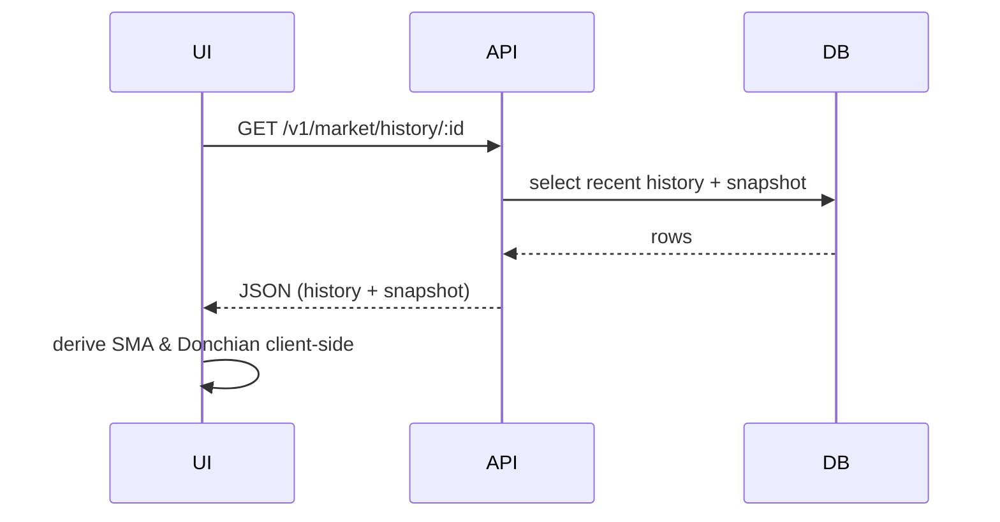

# EVE Online Data Browser

End-to-end data engineering + visualization stack for EVE Online. Ingests the official Static Data Export (SDE) JSON bundles and live market data (ESI + optional snapshot), normalizes into PostgreSQL, serves a typed Fastify API, and renders an analytical React (Vite) UI. Outcome: a fast, observable, extensible substrate for higher-value features (forecasting, cost modeling, optimization, ML overlays) without reworking core data plumbing.

> Mission: Make rich game data instantly explorable & production-friendly so advanced analytics (volatility, predictive pricing, blueprint economics) can ship as thin verticals instead of platform rebuilds.

### Why It Matters (Employer Lens)
- Platform before product: solid ingestion + contracts → rapid iteration on analytic features.
- Clear vertical seams: UI ↔ API ↔ DB boundaries reduce coupling / refactor cost.
- Production hygiene early: deterministic ingestion, cache headers, structured health, typed contracts.
- Performance consciousness: width/height persistence, debounced observers, selective stale time tuning.
- Extensible indicators: SMA, Donchian, median already wired—easy to plug in volatility bands / forecasts.
- Data science ready: consistent 60d history + snapshot schema supports feature engineering & labeling.
- Maintainability: minimal global state (Zustand) and lean React Query usage keep cognitive load low.
- Observability hooks present for future metrics (latency histograms, cache hit ratio instrumentation).

UI polish that supports analysis:
- Snapshot bar (buy/sell + 5% bands) appears above legend for immediate market context.
- Centered legend toggles (median, moving averages, Donchian, volume) enable quick comparative exploration.
- Viewport-constrained chart maintains readability without forcing page scroll.

## Overview

- Fastify API (Node 20) – health, hierarchical database search, item detail, market history, database browsing
- React 18 / Vite Web UI – searchable hierarchy, item & market panels, accessibility‑first interaction
- PostgreSQL 15 – normalized EVE universe subset (categories, groups, types + market history tables)
- Ingestion Scripts – deterministic JSON/JSONL → table mapping, checksum & summary reporting
- Observability – structured logs + lightweight dependency timing
- Test Coverage – layered (unit, integration, functional) with fast feedback loops

### Feature Highlights

| Area | Capability | Notes |
|------|------------|-------|
| Database Search | Debounced hierarchical category → group → type search | Sub‑second for typical queries |
| Item + Market Detail | Inline panel with snapshot + 60d history | Snapshot bar + centered toggle legend |
| DB Explorer | Whitelisted table + pagination viewer | Defensive input sanitization |
| Health & Status | `/v1/health` endpoint with dependency timings | Surfaces DB latency and cache indicators |
| Ingestion | Lite SDE importer with checksum + summary logs | Deterministic JSON artifacts for analysis |
| Testing | Vitest (unit/integration) + Playwright (functional) | Focus on latency + contract resilience |
| Accessibility | Keyboard + screen reader friendly controls | Semantic roles + ARIA labels |
| Performance | Width persistence + debounce, staleTime tuning | Minimizes layout thrash & redundant fetches |
| Visualization Clarity | Disconnected median points (no implied continuity) | Reduces misreading of sparse/volatile days |

## Architecture

### Data Flow (Simplified)
```mermaid
flowchart TD
  subgraph Sources
  SDE[SDE JSON Export\n(categories, groups, types, blueprints)]
    EVEAPI[EVE API\n(market snapshots & history)]
  end
  SDE --> ETL[Ingestion Pipeline\n(parse & normalize)]
  EVEAPI --> ETL
  ETL --> DB[(PostgreSQL)]
  DB --> API[Fastify API]
  API --> Web[React UI]
  Web --> Users[(Users)]
  Users --> Web
```
*Diagram source stored inline (Mermaid). Reflects combined schema hash `e7c02046d71511e0a0999af6cda1d67c250e5ca813c2e0bb428d0209452635ac`.*

### Market Data Path (Minimal)

*Sequence diagram mirrors the same schema hash (`e7c02046d71511e0a0999af6cda1d67c250e5ca813c2e0bb428d0209452635ac`) for provenance.*
Design note: Indicators are derived client‑side; persisted data stays concise. Median now renders as isolated points (no connecting line) to avoid implying continuity across gaps.

### Technology Rationale
- Fastify: low overhead, schema‑driven, easy plugin ecosystem.
- PostgreSQL: relational integrity + JSON columns for flexible attribute extensions.
- Ingestion (Node/TypeScript): deterministic, idempotent JSONL → relational transforms; easy re-run.
- React + Vite: fast iteration, future SSR compatibility.
- React Query: coherent remote data cache, stale‑while‑revalidate semantics.
- Zustand: minimal predictable global UI state (selection, toggles, viewport) without context bloat.
- TypeScript: shared types across ingestion, API, and browser for contract safety.

### Performance & Reliability
- Debounced ResizeObserver + width persistence prevents width thrash during layout changes (min width guard 420px).
- Tuned stale times: history moderately cached; snapshots short TTL; manual `?refresh=1` invalidation.
- Ingestion checksum & diff logging avoids redundant full reloads.
- Uniform 200 + empty body for “unknown” items reduces error branching.
- Slim bundle (no heavy 3D libs) keeps initial load low.

## Quickstart

> Dependencies install automatically when the containers start. Rerun `docker compose exec api npm install` if you need to refresh `node_modules` manually.

1. Start services: `docker compose up -d`
2. Confirm containers are healthy: `docker compose ps`
3. Import the latest SDE snapshot into Postgres: `docker compose exec api sh -lc "cd /workspace && npm run sde:import"`
4. (Optional) Backfill market data: `docker compose exec api npm run ingest:market:esi -- --days 90 --region 10000002`
5. Verify API health from inside the container: `docker compose exec api curl -s http://localhost:3000/v1/health | jq`
6. Open UI: http://localhost:5600/
7. Run API tests: `docker compose exec api npm run test`
8. Run Web tests: `docker compose exec web npm run test:all`
9. Optional validation snapshot: `docker compose exec api sh -lc "cd /workspace && npm run bootstrap:validate"`
10. Optional smoke workflow: `docker compose exec api sh -lc "cd /workspace && npm run smoke"`

Need additional container guidance or port overrides? See the retained ops notes in `docs/runbooks/OPS_RUNBOOK.md#deployment-monitoring-and-ingestion-schedules`.

### SDE ingest (runbook aligned)

- Primary command: `docker compose exec api sh -lc "cd /workspace && npm run sde:import"`
  - Automatically downloads the latest CCP-provided SDE archive if the cached ETag differs.
  - Extracts `fsd/groups.yaml`, `fsd/marketGroups.yaml`, and `fsd/types.yaml`, then refreshes the `sde_master` tables and eligibility materialized views.
- Optional flags (pass after `npm run sde:import --`):
  - `--force` – always download the archive even if the cached copy is current.
  - `--output-dir <path>` – change where the archive/extracted YAML files are stored (default `data/sde`).
  - `--database-url <url>` – override the Postgres connection string.
- After the script completes, spot-check counts: `SELECT COUNT(*) FROM sde_master.sde_types;` should match the latest SDE release.

### Targeted market refresh (runbook aligned)

Follow the workflow in `docs/runbooks/MARKET_OPERATIONS.md#market-history-refresh-workflow` when you need to backfill stale types:

1. Produce a staleness report: `docker compose exec api npm run ingest:market:report -- --days 14 --limit 50`
2. Run the suggested `ingest:market:esi` command (or the guarded batch endpoint) for the affected type IDs.
3. Re-run the report and archive before/after evidence under `logs/bootstrap/market-refresh/`.

## Smoke Workflow

- Orchestrates migrations, ingestion dry-run/full run, API cache warm-up, and health probes via `scripts/smoke/run-smoke-workflow.mjs`.
- Persisted logs land in `logs/smoke/<timestamp>/` for later review (capturing CLI output, API responses, and manifest snapshots).
- Requires PostgreSQL surfaced either through `docker compose up -d` or a reachable `DATABASE_URL` in the environment.
- Compose keeps Postgres internal; run `docker compose exec api sh -lc "cd /workspace && DATABASE_URL=postgres://eveapp:eveapp@db:5432/eveapp npm run smoke"` or provide an external `DATABASE_URL` when invoking locally.
- Smoke run exits non-zero on any failed command so CI hooks can gate merges; rerun with `DEBUG=smoke` for expanded logging.
- After the script succeeds, open `http://localhost:5600` and confirm the Status Indicator reports healthy cache and ingestion telemetry (capture screenshots or console logs for the run summary).
- Note the `requests` block in `/v1/internal/metrics` (avg/max latency, error counts) and archive the JSON response with smoke artefacts.
- Fractional market volumes from ESI are rounded for the bigint columns while the exact decimal is stored in `volume_exact` / `snapshot_volume_exact` for auditing.

## Release Playbook

- Reference schema hash `e7c02046d71511e0a0999af6cda1d67c250e5ca813c2e0bb428d0209452635ac` in change tickets and post-release notes; rerun the schema verification harness before tagging.
- Deploy sequence: run migrations inside the API container (for example `docker compose exec api sh -lc "cd /workspace && npm run persistence:migrate"`), execute full ingestion with `docker compose exec api npm run ingest:market:esi -- --days 365 --region 10000002`, restart the API service, then probe `/v1/health`, `/v1/market/history`, and `/v1/internal/metrics` (store responses alongside smoke artefacts).
- Web shell verification: ensure the Status Indicator mirrors the metrics payload (cache hit rate, ingestion lag, schema hash); capture screenshots for the release archive.
- Rollback triggers: sustained 5xx rate > 5 %, ingestion lag > 3600 s, or schema hash mismatch. On trigger, restore latest known-good database snapshot, redeploy the previous API image, and rerun the smoke workflow.
- Document outcomes and any follow-up tasks in `master-plan.md` (Operational Cadence) and update `tasks.md` if remediation or hardening work is required; capture all notes while still inside the API container (`docker compose exec api sh -lc "cd /workspace && <editor or git command>"`).

## API Surface

| Method | Path | Purpose |
|--------|------|---------|
| GET | `/v1/health` | Overall & dependency status (200 / 503) |
| GET | `/health` | Legacy health alias |
| GET | `/v1/taxonomy/search?query=&limit=` | Hierarchical (category/group/type) search (internal name retained) |
| GET | `/v1/items/:typeId` | Item detail + attributes + cache headers |
| GET | `/v1/market/history/:typeId` | 60‑day market history + snapshot (ETag, Cache-Control) |
| GET | `/v1/market/history/:typeId?refresh=1` | Forced refresh (bypass caches) |
| GET | `/v1/market/debug/:typeId` | Diagnostic cache/status info |
| GET | `/v1/db/tables` | Whitelisted table list |
| GET | `/v1/db/table/:table?limit=&offset=` | Paginated table rows + total count |

## Sample Data & UI

Screenshots:

| Sidebar Hierarchy | (Pending) Market History |
|-------------------|--------------------------|
|  | _Market history chart (median points; unified axis band)._ |

Example database search response:
```json
{
   "categories": [
      { "id": 6, "name": "Ships", "groups": [ { "id": 25, "name": "Frigate", "types": [ { "id": 587, "name": "Rifter" } ] } ] }
   ],
   "dataVersion": "2025-09-30"
}
```

## Development Workflow

## Environment Variables

| Variable | Default | Scope | Purpose |
|----------|---------|-------|---------|
| DB_HOST | localhost (api container uses `db`) | API | Postgres host |
| DB_PORT | 5432 | API | Postgres port |
| DB_USER | eveapp | API/DB | Postgres user |
| DB_PASSWORD | eveapp | API/DB | Postgres password |
| DB_NAME | eveapp | API/DB | Database name |
| DATABASE_URL | (unset) | API | Optional full connection string (overrides individual DB_* vars) |
| PORT | 3000 | API | API listen port |
| HOST | 0.0.0.0 | API | Bind host |
| SERVICE_NAME | evedatabrowser-api | API | Service identity (health/metrics) |
| SERVICE_VERSION | package.json version | API | Reported version |
| CONTRACTS_URL | http://localhost:3400/public/openapi.json | API | OpenAPI doc URL in health payload |
| TAXONOMY_PAGE_SIZE_DEFAULT | 50 | API | Default hierarchical search page size |
| TAXONOMY_PAGE_SIZE_MAX | 100 | API | Max hierarchical search page size |
| API_CACHE_TAXONOMY | public, max-age=3600, stale-while-revalidate=120 | API | Cache-Control header + TTL applied to taxonomy responses |
| API_CACHE_ITEMS | public, max-age=3600, stale-while-revalidate=120 | API | Cache-Control header + TTL for item detail responses |
| API_CACHE_MARKET | public, max-age=300, stale-while-revalidate=120 | API | Cache-Control header + TTL for market history/latest endpoints |
| API_CACHE_HEALTH | no-store | API | Cache policy for `/v1/health` (typically `no-store`) |
| API_CACHE_INVALIDATE_TOKEN | (unset) | API/Ingestion | Shared secret enabling `POST /v1/internal/cache/invalidate` |
| API_CACHE_INVALIDATE_URL | (unset) | Ingestion | Base URL the ingestion CLI calls after successful imports |
| CORS_ALLOWED_ORIGINS | (unset) | API | Comma list; if unset permissive dev default |
| MARKET_DEFAULT_REGION | 10000002 | API | EVE region (The Forge) for market queries |
| MARKET_USER_AGENT | EVEDataBrowser/0.2 (...) | API | HTTP UA string for ESI politeness |
| SNAPSHOT_CACHE_TTL_MS | (unset) | API | Override snapshot cache TTL (ms) |
| HISTORY_CACHE_TTL_MS | (unset) | API | Override history cache TTL (ms) |
| MARKET_FETCH_MAX_ATTEMPTS | (unset) | API | Retry ceiling for market fetches |
| MARKET_DISABLE_RATE_LIMIT | 0 | API | Set to 1 to disable internal throttling (dev only) |
| SKIP_MARKET_ENSURE | 0 | API | Set to 1 to skip ensuring market tables (faster tests) |
| LOG_LEVEL | info | API | pino log level |
| WEB_PORT | 5173 | Web | Dev server port |
| VITE_API_BASE_URL | http://localhost:3400 | Web | Runtime API base URL (browser fetch) |
| VITE_PROXY_API | http://localhost:3400 | Web | Dev proxy target (can differ for tunneling) |

Note: The API listens on port 3000 inside its container but is exposed on host port 3400 by default. The Web dev server listens on port 5173 inside its container and is exposed on host port 5600. You can override host ports via `HOST_API_PORT` and `HOST_WEB_PORT` when invoking Docker Compose, e.g. `HOST_API_PORT=8080 HOST_WEB_PORT=8081 docker compose up -d`. For the broader ops context and cache verification checklist, see `docs/runbooks/OPS_RUNBOOK.md#cache-configuration-verification`.

No third‑party secret tokens are required: all market data is sourced directly from the public ESI endpoints. Upcoming: cache metrics (hit %, entry count, avg age) surfaced under API status once metrics endpoint exports new fields.

## Adaptability

The pipeline is intentionally domain‑agnostic.

Porting to another dataset:
1. Replace JSON loader with new extractor (CSV/JSONL/etc.).
2. Map fields → relational tables (reuse naming or adjust migration scripts).
3. Re-run ingestion; taxonomy search endpoints continue to work automatically if hierarchy tables exist.
4. Customize frontend attribute panel (no changes required to search flow).

Low coupling ensures analytics (volatility, clustering, forecasting) can attach without modifying ingestion core.

## Data & Attribution

## License

## Support / Questions

## Stack & Tooling Detail

| Layer | Technology | Rationale |
|-------|------------|-----------|
| Runtime | Node.js 20 | Modern language features + stable perf |
| API Framework | Fastify 4 | Low overhead, plugin lifecycle hooks |
| DB | PostgreSQL 15 | Relational model + JSON flexibility |
| Web Build | Vite + esbuild | Fast TS compile + HMR |
| UI | React 18 | Concurrency primitives, ecosystem |
| State | React Query / Zustand | Separate remote vs UI state |
| Tests | Vitest / Supertest / Playwright | Layered confidence (unit→integration→functional) |
| Styles | CSS Modules, design tokens | Theming & encapsulation |
| Observability | Custom logs + metrics endpoints | Latency histograms / cache hit ratios |

### Data Science Extension Hooks
- Snapshot + history structure ready for volatility / regime detection
- SMA + Donchian overlays as baseline technical indicators
- Deterministic ingestion artifacts for offline feature engineering
- Clear seam for ML service (predictive price bands)

### Potential Next Extensions
1. ARIMA / SARIMAX microservice with feature store table
2. Blueprint Bill-of-Materials cost roll‑ups
3. Correlation matrix (price delta vs volume) across ship classes
4. Incremental ingestion with CDC or checksums
5. Advanced caching tier (Redis) for hot history slices

Each can land without major refactors due to vertical isolation.

---

<!-- End of README -->
